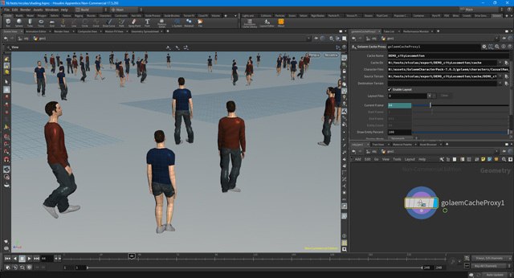

# Golaem For Houdini

Golaem For Houdini is a plugin which takes advantage of procedural geometry generation to animate geometries from Golaem Simulation Caches within Houdini.
Thus, it avoids baking out geometry, handles geometry and shading variation and Golaem Layout edits.

###
## License
Golaem For Houdini source code is released under the [GNU Lesser General Public License v2.1](LICENSE).

###
## Prerequisites
- [Golaem For Maya](http://download.golaem.com)
- Houdini SDK
> Please use the same version of Golaem For Maya as the Golaem For Houdini tag you're compiling

###
## Documentation
Official documentation for the plugin can be found here: [http://houdini.golaem.com](http://houdini.golaem.com)

###
## Changelog
Changelog for the plugin can be found here: [ChangeLog](CHANGELOG)
